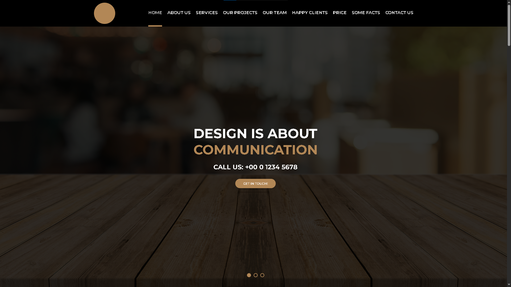

# Projeto AWAX

Este projeto é uma página de apresentação desenvolvida durante meus estudos em HTML e CSS. Segui como base um exercício do curso da B7Web, mas adaptei com minhas próprias ideias e estrutura para praticar responsividade e organização de layout.

## 📸 Preview

## 🚀 O que tem no projeto

- Página institucional com visual moderno e responsivo  
- Seções completas: serviços, portfólio, equipe, planos e contato  
- Galeria de projetos com efeitos ao passar o mouse  
- Formulário de contato com estilo limpo e funcional  
- Menu adaptado para diferentes tamanhos de tela  
- Estrutura organizada usando apenas HTML e CSS

## 🛠 Tecnologias

- HTML5
- CSS3
- Google Fonts

## 👨‍💻 Sobre
Desenvolvido por **Tiago Lima** como prática de estruturação semântica, responsividade e layout moderno utilizando apenas HTML e CSS. 
 Áreas que necessitam de JavaScript para funcionarem já foram deixadas prontas para implementação
